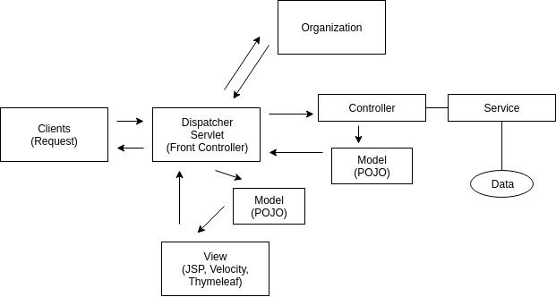
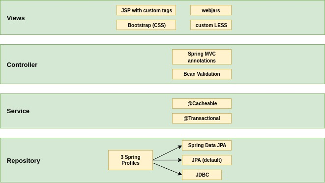
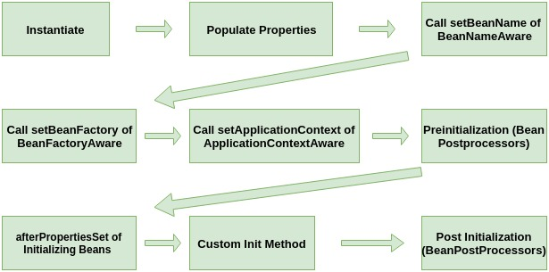
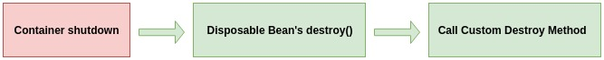

# Spring Framework 5: Beginner to Guru

#### Building a Spring Boot Web App

- Go to https://start.spring.io/
  - **Group**: guru.springframework
  - **Artifact**: spring5webapp
  - JPA, H2, Thymeleaf, Web
- Application uses JPA and H2 embedded db
- [H2 web console](http://localhost:8080/h2-console)
  - Driver Class: org.h2.Driver
  - JDBC URL: jdbc:h2:mem:testdb
- Entities

```java

@Entity
public class Book {
    @Id
    @GeneratedValue(strategy = GenerationType.AUTO)
    private Long id;
    private String title;
    private String isbn;
    private String publisher;

    @ManyToMany
    @JoinTable(name = "author_book", joinColumns = @JoinColumn(name = "book_id"), inverseJoinColumns = @JoinColumn(name = "author_id"))
    private Set<Author> authors = new HashSet<>();
    }
    
@Entity
public class Author {

    @Id
    @GeneratedValue(strategy = GenerationType.AUTO)
    private Long id;
    private String firstName;
    private String lastName;

    @ManyToMany(mappedBy = "authors")
    private Set<Book> books = new HashSet<>();
}    
   
```

##### Equality in Hibernate

- Use unique bussiness key
- Otherwise use Id

```java
@Override
    public boolean equals(Object o) {
        if (this == o) return true;
        if (o == null || getClass() != o.getClass()) return false;
        Author author = (Author) o;
        return Objects.equals(id, author.id);
    }

  @Override
    public boolean equals(Object o) {
        if (this == o) return true;
        if (o == null || getClass() != o.getClass()) return false;
        Book book = (Book) o;
        return Objects.equals(id, book.id);
    }
```

##### Initializing Data with Spring Framework Event

- When an application starts, test data is saved to h2 embedded db
- Class `DevBootstrap` implements  `ApplicationListener` and listens to `ContextRefreshedEvent` events

```java
import org.springframework.context.ApplicationListener;
import org.springframework.context.event.ContextRefreshedEvent;
import org.springframework.stereotype.Component;

@Component
public class DevBootstrap  implements ApplicationListener<ContextRefreshedEvent> {

    private AuthorRepository authorRepository;
    private BookRepository bookRepository;

    @Override
    public void onApplicationEvent(ContextRefreshedEvent contextRefreshedEvent) {
        initData();
    }

    private void initData(){

        //Eric
        Author eric = new Author("Eric", "Evans");
        Book ddd = new Book("Domain Driven Design", "1234", "Harper Collins");
        ddd.getAuthors().add(eric);
        eric.getBooks().add(ddd);
        authorRepository.save(eric);
        bookRepository.save(ddd);

        //Rod
        Author rod = new Author("Rod", "Johnson");
        Book noEJB = new Book("J2EE Development without EJB", "23444", "Worx");
        rod.getBooks().add(noEJB);
        authorRepository.save(rod);
        bookRepository.save(noEJB);
    }
```

##### Intro to Spring MVC 





- Controllers are created with an annotation `@Controller`
- Http methods are mapped with `@RequestMapping`

```java
@Controller
public class BookController {
    //.........../
    
  @RequestMapping("/books")
    public String getBooks(Model model) {
        model.addAttribute("books", bookRepository.findAll());
        return "books";
    }
}
```

##### Spring Pet Clinic



 

#### Dependency Injection with the Spring Framework

##### Types of Dependency Injection

- By class properties - least preferred
- Using private properties is EVIL
- By Setters - Area of much debate
- By Constructor - **Most Preferred**

##### Concrete Classes vs Interfaces

- DI can be done with Concrete Classes or with Interfaces
- Generally DI with Concrete Classes should be avoided
- DI via Interfaces is **highly preferred**
- Allows runtime to decide implementation to inject
- Follows Interface Segregation Principle of SOLID
- Also, makes your code more testable

##### IoC vs DI

- Inversion of Control - aka IoC Is a technique to allow dependencies
  to be injected at runtime by a framework
- DI refers much to the composition of your classes

##### DI with Spring

- Injecting by a property

```java
@Controller
public class PropertyInjectedController {
    @Autowired
    public GreetingServiceImpl greetingService;
}
```

- Injecting by a setter

```java
@Controller
public class SetterInjectedController {
	private GreetingService greetingService;

    @Autowired
    public void setGreetingService(GreetingService greetingService) {
        this.greetingService = greetingService;
    }
}
```

- Injecting by a constructor
- Using `@Autowired` is optional

```java
@Controller
public class ConstructorInjectedController {
    private GreetingService greetingService;

    public ConstructorInjectedController(GreetingService greetingService) {
        this.greetingService = greetingService;
    }
}
```

##### Using Spring Qualifier

- When more than one bean class implements the same interface it is necessary point at a particular one which we want to inject.
- `@Qualifier` in a constructor 

 ```java
public ConstructorInjectedController(@Qualifier("constructorGreetingService") GreetingService greetingService) {
        this.greetingService = greetingService;
}
 ```

* `@Qualifier` in a setter method

```java
 @Autowired
 public void setGreetingService(@Qualifier("constructorGreetingService") GreetingService greetingService) {
        this.greetingService = greetingService;
}
```

-  In a property based injecting it is possible to skip `@Qualifier` if  property's name is same is injected class name.

```java
 @Autowired
 public GreetingService greetingServiceImpl;
```

##### Primary Annotation

- Another way to decide which bean should be injected is marking that bean a primary

```java
@Service
@Primary
public class PrimaryGreetingService implements GreetingService{
    @Override
    public String sayGreeting() {
        return "Hello - Primary Greeting service";
    }
}
```

##### Spring Profiles

- Bean of a class annotated with profile "en" is created only when that profile is on.   

```java
@Profile("en")
public class PrimaryGreetingService implements GreetingService{
    @Override
    public String sayGreeting() {
        return "Hello - Primary Greeting service";
    }
}
```

- Switching on profiles with the configuration.

```properties
spring.profiles.active=en
```

##### Default profile

- **Default** profile is chosen if **active** profile is not setup.

```java
@Service
@Profile({"en", "default"})
@Primary
public class PrimaryGreetingService implements GreetingService{
    @Override
    public String sayGreeting() {
        return "Hello - Primary Greeting service";
    }
}
```

##### Spring Bean Life Cycle








###### Callback Interfaces

- Spring has two interfaces you can implement for call back events:
  - `InitializingBean.afterPropertiesSet()` called after properties are set
  - `DisposableBean.destroy()` called during bean destruction in shutdown

###### Life Cycle Annotations

- Spring has two annotations you can use to hook into the bean life cycle

  - `@PostConstruct` annotated methods will be called after the bean has been constructed, but before its returned to the requesting object

  - ###### `@PreDestroy` is called just before the bean is destroyed by the container

###### Bean Post Processors

- Gives you a means to tap into the Spring context life cycle and interact with beans as they are processed:
- Implement interface BeanPostProcessor
  - `postProcessBeforeInitialization` - Called before
    bean initialization method
  -  `postProcessAfterInitialization` - Called after bean
    initialization

###### 'Aware' Interfaces

- Spring has over 14 ‘Aware’ interfaces.
- They are used to access the Spring Framework
  infrastructure

  |        Aware Interface         |                         Description                          |
  | :----------------------------: | :----------------------------------------------------------: |
  |    ApplicationContextAware     | Interface to be implemented by any object that wishes to be notified 	 of the ApplicationContext that it runs in |
  | ApplicationEventPublisherAware | Set the ApplicationEventPublisherthat this<br/>object runs in. |
  |      BeanClassLoaderAware      | Callback that supplies the bean class<br/>loader to a bean instance. |
  |        BeanFactoryAware        | Callback that supplies the owning factory<br/>to a bean instance. |
  |         BeanNameAware          | Set the name of the bean in the bean<br/>factory that created this bean. |
  |     BootstrapContextAware      |    Set the BootstrapContext that this object<br/>runs in.    |
  |      LoadTimeWeaverAware       | Set the LoadTimeWeaver of this object’s<br/>containing ApplicationContext. |
  |       MessageSourceAware       |       Set the MessageSource that this object runs in.        |
  |   NotificationPublisherAware   | Set the NotificationPublisher instance for the<br/>current managed resource instance. |
  |       PortletConfigAware       |          Set the PortletConfig this object runs in.          |
  |      PortletContextAware       |       Set the PortletContext that this object runs in.       |
  |      ResourceLoaderAware       |       Set the ResourceLoader that this object runs in.       |
  |       ServletConfigAware       |       Set the ServletConfig that this object runs in.        |
  |      ServletContextAware       |       Set the ServletContext that this object runs in.       |

##### Single Responsibility Principle in Spring

Controller objects have no business interacting with the database. Nor do controllers have any business implementing other business logic. In practice your controller methods should be very simple and light. Database calls and other business logic belong in a service layer.

##### Open Closed Principle

Solution it to create abstraction classes or interfaces and concrete classes with implementation realizing features (open for development new features).

##### Liskov Substitution Principle

If you’re writing objects which extend classes, but fails the **‘Is-A’** test it means that you are violating the principle. For example when inherited  method cannot be implemented or need to be empty. 

The solution is to  correct **inheritance hierarchy**.

##### Interface Segregation Principle

What the Interface Segregation Principle says is that your interface should not be bloated with methods that implementing classes don’t require. 

##### Dependency Inversion Principle

- High-level modules should not depend on low-level modules. Both should not depend on abstractions.
- Abstractions should not depend on details. Details should depend on abstractions.
- Use Interfaces to decouple your code

##### Interface Naming Conventions

- Interface should be a good object name ie. `List` interface
- Don’t Start with ‘I’
- When just one implementation - generally accepted to use
  <Interface Name> + Impl
-  When more than one, name should indicate difference of
  Implementation 

#### Tips and triks

##### Custom Banner

- Go to [font generator](http://patorjk.com/software/taag/#p=display&f=Graffiti&t=Type%20Something%20).
- Select font and type the  text.
- Click **Select & Copy**.
- Create **banner.txt** in the resources.

#### Spring Framework Configuration

##### Spring Configuration Options

- XML Based Configuration
- Annotation Based Configuration
  - Since Spring 3
  - Refers to class level annotations
  - `@Controller, @Service, @Component,
    @Repository`
- Java Based Configuration
  - Since Spring 3
  - Configuration classes are defined with
    `@Configuration` annotation
  - Beans are declared with @Bean annotation
- Groovy Bean Definition DSL Configuration
  - Since Spring 4
  - Allows you to declare beans in Groovy

#### Spring Framework Stereotypes

- Available Stereotypes - `@Component, @Controller,
  @RestController, @Repository, @Service`
- @Component - Indicates that an annotated class is a “component” and it will
  be created as a bean
- @Controller - Indicates that an annotated class has the role of a Spring
  MVC “Controller”
- @RestController - Convenience Annotation which extends @Controller, and
  adds @ResponseBody
- @Repository - Indicates that an annotated class is a “Repository”, originally
  defined by Domain-Driven Design (Evans, 2003) as “a
  mechanism for encapsulating storage, retrieval, and search
  behavior which emulates a collection of objects”
- @Service - Indicates that an annotated class is a “Service”, originally
  defined by Domain-Driven Design (Evans, 2003) as “an
  operation offered as an interface that stands alone in the
  model, with no encapsulated state.”

###### @Repository - wraps specific DB exceptions into Spring ones

- DataAccessException 
  - DataAccessResourceFailureException
  - CleanupFailureDataAccessException
  - InvalidDataAccessApiUsageException
  - InvalidDataAccessResourceUsageException
    - IncorrectUpdateSemanticsDataAccessException
    - TypeMismatchDataAccessException
  - DataRetrievalFailureException
    - ObjectRetrievalFailureException
  - OptimisticLockingFailureException
    - ObjectOptimisticLockingFailureException
  - UncategorizedDataAccessException
  - DataIntegrityViolationException
  - DeadlockLoserDataAccessException

##### Spring Component Scan

- You can overwrite the default scanning with an annotation `@ComponentScan`

  ```
  @ComponentScan(basePackages = {"guru.services", "guru.springframework"})
  public class DiDemoApplication {
  
  }
  ```

##### Java Configuration example

```java
@Configuration
public class ChuckConfiguration {

    @Bean
    public ChuckNorrisQuotes chuckNorrisQuotes() {
        return new ChuckNorrisQuotes();
    }
}
```

##### Spring XML Configuration example

```java
//importing a config file
@ImportResource("classpath:chuck-config.xml")
public class JokeappApplication { }
```

```xml
<?xml version="1.0" encoding="UTF-8"?>
<beans xmlns="http://www.springframework.org/schema/beans"
       xmlns:xsi="http://www.w3.org/2001/XMLSchema-instance"
       xsi:schemaLocation="http://www.springframework.org/schema/beans http://www.springframework.org/schema/beans/spring-beans.xsd">


    <bean name="chuckNorrisQuotes" class="guru.springframework.norris.chuck.ChuckNorrisQuotes"/>
</beans>
```

##### Spring Factory Beans

```java
@Configuration
public class GreetingServiceConfig {
    @Bean
    GreetingServiceFactory greetingServiceFactory(GreetingRepository repository) {
        return new GreetingServiceFactory(repository);
    }

    @Bean
    @Profile({"en", "default"})
    @Primary
    GreetingService primaryGreetingService(GreetingServiceFactory 
                                           greetingServiceFactory) {
        //creating a bean is delegated to the factory
        return greetingServiceFactory.createGreetingService("en");
    }
}

```

```java
public class GreetingServiceFactory {

    public GreetingService createGreetingService(String lang){
        switch (lang){
            case "en":
                return new PrimaryGreetingService(greetingRepository);
            case "de":
                return new PrimaryGermanGreetingService(greetingRepository);
            case "es":
                return new PrimarySpanishGreetingService(greetingRepository);
            default:
                return new PrimaryGreetingService(greetingRepository);

        }
    }

}
```

##### Spring Boot Configuration

###### Dependency Management

- Maven or Gradle are supported for curated dependencies
- Each version of Spring Boot is configured to work with a specific version of Spring Framework
- Overriding the Spring Framework Version is not recommended

###### Maven Support

- Maven projects inherit from a Spring Boot Parent POM
- When possible, do not specify versions in your POM. Allow the versions to inherit from the
  parent
- The Spring Boot Maven Plugin allows for packaging the executable jar

###### Spring Boot Starters

- Starters are top level dependencies for popular Java libraries
- Will bring in dependencies for the project and related Spring components
- Starter ‘spring-boot-starter-data-jpa’ brings in:
  - Hibernate
  - Spring Data JPA - and related Spring deps

###### Spring Boot Annotations

@SpringBootApplication - main annotation to use

Includes:

- @Configuration - De clares class as Spring Configuration
- @EnableAutoConfiguration - Enables auto configuration
- @ComponentScan - Scans for components in current package and all child packages

###### Disabling Specific Auto Config

- Auto-configuration will bring in A LOT of configuration classes in supplied Spring Boot Jars

- You can specify classes to exclude with:
  - `@EnableAutoConfiguration(exclude={DataSourceAutoConfiguration.class})`

##### Spring Bean Scopes

- Singleton - (default) Only one instance of the bean is created in the IoC container.
- Prototype - A new instance is created each time the bean is requested.
- Request - A single instance per http request. Only valid in the context of a web-aware Spring ApplicationContext.
- Session - A single instance per http session. Only valid in the context of a web-aware Spring ApplicationContext.
- Global-session - A single instance per global session. Typically Only used in a Portlet context. Only valid in the context of a web-aware Spring ApplicationContext.
- Application - bean is scoped to the lifecycle of a ServletContext. Only valid in the context of a web aware.
- Websocket - Scopes a single bean definition to the lifecycle of a WebSocket. Only valid in the context of a web-aware Spring ApplicationContext.
- Custom Scope - Spring Scopes are extensible, and you can define your own scope by
  implementing Spring’s ‘Scope” interface
- You cannot override the built in Singleton and Prototype Scopes

#### External Properties with Spring Framework

##### Property Source

* Create additional **.properties** file

* Define bean `PropertySourcesPlaceholderConfigurer` to turn on **${…}** placeholders

  ```java
  @Bean
  public static PropertySourcesPlaceholderConfigurer properties() {
  	PropertySourcesPlaceholderConfigurer propertySourcesPlaceholderConfigurer = new
  	PropertySourcesPlaceholderConfigurer();
      return propertySourcesPlaceholderConfigurer;
   }
  ```

* Map properties onto a  class

  ```java
  @Configuration
  @PropertySource("classpath:datasource.properties")
  public class PropertyConfig {
  
      @Value("${guru.username}")
      String user;
  
      @Value("${guru.password}")
      String password;
  
      @Value("${guru.dburl}")
      String url;
      
    }
  ```

  

##### Spring Environment Properties

- Edit **Run Configuration** 

- Add Environment property ie. `USERNAME=MyOVERIDE!!!`

- The setting will overwrite other properties read form .properties files.

- You can access that property ie.  with `Environment` object 

  ```java
  @Autowired
  Environment env;
  
  @Bean
  public FakeDataSource fakeDataSource() {
  	FakeDataSource fakeDataSource = new FakeDataSource();
      fakeDataSource.setUser(env.getProperty("USERNAME"));
      fakeDataSource.setPassword(password);
      fakeDataSource.setUrl(url);
      return fakeDataSource;
  }
  ```


##### Multiple Property File

- Configure multiple property sources

  ```java
  @PropertySource({"classpath:datasource.properties", "classpath:jms.properties"})
  
  //or
  
  @PropertySources({
      @PropertySource("classpath:datasource.properties"),
      @PropertySource("classpath:jms.properties")
  })
  ```

##### Spring Boot Application.properties

- Spring configurations as well as out custom properties can be stored in application.properties

  ~~~properties
  spring.profiles.active=es
  
  guru.username=John
  guru.password=somepass
  guru.dburl=sdfasdffasdf
  
  guru.jms.username=JMS Username
  guru.jms.password=somepass
  guru.jms.url=SomeURL
  ~~~

##### YAML properties

```yaml
# this is a comment

name: John

names: #Comment
  - John
  - Paul
  - Ringo

pound_sign: "#"

book:
    author: Joe Buck
    publisher: random house

truth: yes

another_truth: True

more_true: true

false: no #No, false, FALSE

string_val: "This is it's quote"

colon_string: "my courses: one two three"

include_new_lines: |
  asdf asdf asdf
  asdf adfewf asdf
  asdf ae adfre

ignore_new_lines: >
  this is
  just one long
  string
```

##### Spring Boot Profile Properties

- Create a separate application.properties per profile ie. **application-de.properties**.

- Create one yml file  with section per profile

  ```yaml
  # default settings
  guru:
    jms:
      username: JMS Username
      password: somepass
      url: SomeURL
  # files separator
  ---
  # 'de' profile section
  spring:
       profiles: de
  
  guru:
    jms:
      username: JMS Username  $$$$$$$$$$$ German
  ```

#### Web Development with Spring MVC

##### Axis TCP Monitor Plugin - IntelliJ plugin for Tcp monitoring

- Install and restart IDE
- There is a tab **TCPMON** on the right hand side
- Assuming that your local Tomcat runs on 8080 you should set:
  - **Listener**, **Target Hostname**: 127.0.0.1
  - **Target Port #**: 8080
  - Listen Port #: your custom free port ie. 8081
  - Open your web app as you usually do but instead of 8080 choose 8081
  - On the tab, you will see the traffic which comes from/to your app

##### Spring Boot Development Tools

- Added via dependency

  ```xml
  <dependency>
  	<groupId>org.springframework.boot</groupId>
      <artifactId>spring-boot-devtools</artifactId>
      <scope>runtime</scope>
  </dependency>
  ```

- Developer Tools are automatically disabled when running a packaged application (ie java -jar)

- Not included in repackaged archives

- Automatic Restart

  - Triggers a restart of the Spring Context when classes change
  - Uses two classloaders. One for your application, one for project jar dependencies

- Eclipse: Restart is triggered with save (which by default will
  compile the class, which triggers the restart)
- IntelliJ: You need to select  **Build** / **Make Project**

- Reloading web pages
  - Developer Tools will disable template caching so the restart is not required to see changes
  - **LiveReload** is a technology to automatically trigger a browser refresh when resources are
    changed
  - Spring Boot Developer Tools includes a **LiveReload** server
  - Browser plugins are available for a free download at livereload.com
- Configuring Intellij
  - Ctrl+Shift+A, a type "Registry"
  - Find and select key "compiler.automake.allow.when.app.running"
  - Go to File / Settings
  - Than select **Build, Execution, Deployment** / Compiler
  - Select checkbox  "Build project automatically"

##### Web Resource Optimizer

- Plugin converts less to css

- Maven dependencies

  ~~~xml
  <properties>
  	<!-- Web dependencies -->
      <webjars-bootstrap.version>3.3.6</webjars-bootstrap.version>
      <webjars-jquery-ui.version>1.11.4</webjars-jquery-ui.version>
      <webjars-jquery.version>2.2.4</webjars-jquery.version>
      <wro4j.version>1.8.0</wro4j.version>
  </properties>
  <!-- webjars -->
  <dependency>
  	<groupId>org.webjars</groupId>
      <artifactId>webjars-locator-core</artifactId>
  </dependency>
  <dependency>
  	<groupId>org.webjars</groupId>
      <artifactId>jquery</artifactId>
      <version>${webjars-jquery.version}</version>
   </dependency>
   <dependency>
   	<groupId>org.webjars</groupId>
      <artifactId>jquery-ui</artifactId>
      <version>${webjars-jquery-ui.version}</version>
   </dependency>
   <dependency>
   	<groupId>org.webjars</groupId>
      <artifactId>bootstrap</artifactId>
      <version>${webjars-bootstrap.version}</version>
  </dependency>
  <!-- end of webjars -->
  
  ~~~

- Plugin configuration

  ~~~xml
  <plugin>
  	<groupId>ro.isdc.wro4j</groupId>
      <artifactId>wro4j-maven-plugin</artifactId>
      <version>${wro4j.version}</version>
      <executions>
      	<execution>
          	<phase>generate-resources</phase>
              <goals>
              	<goal>run</goal>
              </goals>
           </execution>
       </executions>
       <configuration>
                      <wroManagerFactory>ro.isdc.wro.maven.plugin.manager.factory.ConfigurableWroManagerFactory</wroManagerFactory>
                      <cssDestinationFolder>${project.build.directory}/classes/static/resources/css</cssDestinationFolder>
  <wroFile>${basedir}/src/main/wro/wro.xml</wroFile>
  
  	<extraConfigFile>${basedir}/src/main/wro/wro.properties</extraConfigFile>
      <contextFolder>${basedir}/src/main/less</contextFolder>
      </configuration>
      <dependencies>
          <dependency>
          	<groupId>org.webjars</groupId>
              <artifactId>bootstrap</artifactId>
              <version>${webjars-bootstrap.version}</version>
          </dependency>
          <dependency>
          	<groupId>org.mockito</groupId>
              <artifactId>mockito-core</artifactId>
          	<version>${mockito.version}</version>
      	</dependency>
  	</dependencies>
  </plugin>
  ~~~

- wro.properties

  ~~~properties
  #List of preProcessors
  preProcessors=lessCssImport
  #List of postProcessors
  postProcessors=less4j
  ~~~

- wro.xml

  ~~~xml
  <groups xmlns="http://www.isdc.ro/wro">
    <group name="petclinic">
    <css>classpath:META-   INF/resources/webjars/bootstrap/3.3.6/less/bootstrap.less</css>
  
     <css>/petclinic.less</css>
     </group>
  </groups>
  
  ~~~

##### Internationalization

- Configure in application.properties `spring.messages.basename=messages/messages`
- Create messages.properties files. The default one and other for each supported languages  messages_de.properties

#### JPA Data Modeling with Spring and Hibernate

##### JPA Entity Relationships

###### Types of Relationships

- One to One - `@OneToOne`
- One to Many - `@OneToMany`
  - One entity is related to many entities (List, Set,
    Map, SortedSet, SortedMap)
- Many to One - @ManyToOne
- Many to Many - @ManyToMany
  - Each entity has a List or Set reference to the other
  - A join table is used to define the relationships

###### Unidirectional vs Bidirectional

- Unidirectional is one-way
  - Mapping is only done one way. One side of the relationship will not know about the other
- Bidirectional is two way
  - Both sides know about each other
  - Recommended since you can navigate the object graph in either direction

###### Owning Side

- The Owning side in the relationship will hold the foreign key in the database

- One to One is the side where the foreign key is specified

- OneToMany and ManyToOne is the "Many" side
- `mappedBy` is used to define the field witch “owns” the reference of the relationship

###### Fetch Type

- Lazy Fetch Type - Data is not queried until referenced
- Eager Fetch Type - Data is queried up front
- JPA 2.1 Fetch Type Defaults:
  - OneToMany - Lazy
  - ManyToOne - Eager
  - ManyToMany - Lazy
  - OneToOne - Eager

###### JPA Cascade Types

- PERSIST - Save operations will cascade to related entities
- MERGE - related entities are merged when the owning entity is merged
- REFRESH - related entities are refreshed when the owning entity is refreshed
- REMOVE - Removes all related entities when the owning entity is deleted
- DETACH - detaches all related entities if a manual detach occurs
- ALL - Applies all the above cascade options

###### Embeddable Types

- JPA / Hibernate support embeddable types
- These are used to group a common set of properties

###### Inheritance

- MappedSuperclass - Entities inherit from a super class. A database table IS NOT created for the super class
- Single Table - (Hibernate Default) - One Table is used for all subclasses

- Joined Table - Base class and subclasses have their own tables. Fetching subclass entities require a join to the parent table
- Table Per Class - Each subclass has its own table

###### Create and Update Timestamp

- For audit purposes
- JPA supports @PrePersist and @PreUpdate which can be used to support audit timestamps via JPA lifecycle callbacks
- Hibernate provides @CreationTimestamp and @UpdateTimestamp

##### Data Initialization with Spring

###### Hibernate DDL Auto

- Hibernate property is set by the Spring property `spring.jpa.hibernate.ddl-auto`.
- Available options are: none, validate, update, create, create-drop.
- Spring Boot will use create-drop for embedded databases (hsql, h2, derby) or none.
- Data can be loaded from import.sql.
- executed if Hibernate’s **ddl-auto** property is set to create or create-drop.

###### Spring JDBC

- Spring Boot will load by default **schema.sql** and **data.sql** from the root of the classpath.
- Spring Boot will also load from **schema-${plaform}.sql and
  data-​${platform}.sql**
  - Must set `spring.datasource.platform`.
- May conflict with Hibernate’s DDL Auto property so use setting of ‘none’ or ‘validate’.

#### Project Lombok

##### Project Lombok Features

- @Getter
  - Creates getter methods for all properties
- @Setter
  - Creates setter for all non-final properties
- @ToString
  - Generates String of classname, and each field separated by commas
  - Optional parameter to include field names
  - Optional parameter to include call to the super toString method
- @EqualsAndHashCode
  - Generates implementations of ‘equals(Object other) and hashCode()
  - By default will use all non-static, non-transient properties
  - Can optionally exclude specific properties
- @NoArgsConstructor
  - Generates no args constructor
  - Will cause compiler error if there are final fields
  - Can optionally force, which will initialize final fields with 0 / false / null
- @RequiredArgsContructor
  - Generates a constructor for all fields that are final or marked @NonNull
  - Constructor will throw a NullPointerException if any @NonNull fields are null
- @Data
  - Generates typical boilerplate code for POJOs
  - Combines - @Getter, @Setter, @ToString, @EqualsAndHashCode, @RequiredArgsConstructor
  - No constructor is generated if constructors have been explicitly declared

- @Value
  - The immutable variant of @Data
  - All fields are made private and final by default
- @NonNull
  - Set on parameter of method or constructor and a NullPointerException will be thrown if parameter is null
- @Builder
  - Implements the ‘builder’ pattern for object creation
  - Person.builder().name("Adam Savage").city("San Francisco").job("Mythbusters").job("Unchained Reaction").build();

- @SneakyThrows
  - Throw checked exceptions without declaring in calling method’s throws clause

- @Syncronized
  - A safer implementation of Java’s synchronized

- @Log
  - Creates a Java util logger
  - Java util loggers are awful

- @Slf4j
  - Creates a SLF4J logger.
  - Recommended - SLF4J is a generic logging facade
  - Spring Boot’s default logger is LogBack

#### Testing Spring Framework Applications

##### Test Scope Dependencies

-  Using spring-boot-starter-test (default from Spring Initializr will load the following
  dependencies:
  - JUnit - The de-facto standard for unit testing Java applications
  - Spring Test and Spring Boot Test - Utilities and integration test support for SpringBoot applications
  - AssertJ -  A fluent assertion library
  - Hamcrest - A library of matcher objects
  - Mockito - A Java mocking framework
  - JSONassert - An assertion library for JSON
  - JSONPath - XPath for JSON

##### JUnit 4 Annotations

| Annotation                       | Description                                                  |
| -------------------------------- | ------------------------------------------------------------ |
| @Test                            | Identifies a method as a test method.                        |
| @Before                          | Executed before each test. It is used to prepare the test environment (e.g.,<br/>read input data, initialize the class). |
| @After                           | Executed after each test. It is used to cleanup the test environment. It can<br/>also save memory by cleaning up expensive memory structures. |
| @BeforeClass                     | Executed once, before the start of all tests. Methods marked with this<br/>annotation need to be defined as static to work with JUnit. |
| @AfterClass                      | Executed once, after all tests have been finished. Methods annotated with this annotation need to be defined as static to work with JUnit. |
| @Ignore                          | Marks that the test should be disabled.                      |
| @Test(expected =Exception.class) | Fails if the method does not throw the named exception.      |
| @Test(timeout = 10)              | Fails if the method takes longer than 100 millseconds.       |

##### Spring Boot Annotations

| Annotation                       | Description                                                  |
| -------------------------------- | ------------------------------------------------------------ |
| @RunWith(SpringRunner.class)     | Run test with Spring Context                                 |
| @SpringBootTest                  | Search for Spring Boot Application for configuration         |
| @TestConfiguraiton               | Specify a Spring configuration for your test                 |
| @MockBean                        | Injects Mockito Mock                                         |
| @SpyBean                         | Injects Mockito Spy                                          |
| @JsonTest                        | Creates a Jackson or Gson object mapper via Spring Bo        |
| @WebMvcTest                      | Used to test web context without a full http server          |
| @DataJpaTest                     | Used to test data layer with embedded database               |
| @JdbcTest                        | Like @DataJpaTest, but does not configure entity manager     |
| @DataMongoTest                   | Configures an embedded MongoDB for testing                   |
| @RestClientTest                  | Creates a mock server for testing rest clients               |
| @AutoConfigureRestDocks          | Allows you to use Spring Rest Docs in tests, creating API documentation |
| @BootStrapWith                   | Used to configure how the TestContext is bootstrap           |
| @ContextConfiguration            | Used to direct Spring how to configure the context for the test. |
| @ContextHierarchy                | Allows you to create a context hierarchy with @ContextConfiguration |
| @ActiveProfiles                  | Set which Spring Profiles are active for the test            |
| @TestPropertySource              | Configure the property sources for the test.                 |
| @DirtiesContext                  | Resets the Spring Context after the test (expensive to do)   |
| @WebAppConfiguration             | Indicates Spring should use a Web Application context        |
| @TestExecutionListeners          | Allows you to specify listeners for testing events           |
| @Transactional                   | Run test in transaction, rollback when complete by default   |
| @BeforeTransaction               | Action to run before starting a transaction.                 |
| @AfterTransaction                | Action to run after a transaction.                           |
| @Commit                          | Specifies the transaction should be committed after the test. |
| @Rollback                        | Transaction should be rolled back after test. (Default action) |
| @Sql                             | Specify SQL scripts to run before                            |
| @SqlConfig                       | Define meta data for SQL scripts                             |
| @SqlGroup                        | Group of @Sql annotations                                    |
| @Repeat                          | Repeat test x number of times                                |
| @Timed                           | Similar to JUnit’s timeout, but will wait for test to complete, unlike JUnit. |
| @IfProfileValue                  | Indicates test is enabled for a specific testing environment |
| @ProfileValueSourceConfiguration | Specify a profile value source                               |

##### JUnit 5

- JUnit 5 leverages new features of Java 8
- Lambda Expressions
- Streams
- Java 8 or Higher is required
- Designed for better integration and extensibility

- JUnit Vintage
  - Optional JUnit 5 Library
  - Provides a test runner for JUnit 3 and 4 tests using JUnit 5
  - Allows easy migration to JUnit 5


| JUNIT 4                                 | JUNIT 5                              |
| --------------------------------------- | ------------------------------------ |
| @Test(expected = Foo.class)             | Assertions.assertThrows(Foo.class... |
| @Test(timeout = 1)                      | Assertions.assertTimeout(Duration... |
| @RunWith(SpringJUnit4ClassRunner.class) | @ExtendWith(SpringExtension.class)   |

###### New Annotations

| JUnit 4      | JUnit 5     |
| ------------ | ----------- |
| @Before      | @BeforeEach |
| @After       | @AfterEach  |
| @BeforeClass | @BeforeAll  |
| @AfterClass  | @AfterAll   |
| @Ignored     | @Disabled   |
| @Category    | @Tag        |

#### CRUD Operations with Spring MVC

##### WebJars

- [webjars](https://www.webjars.org/)

- Add as maven dependency

```xml
        <dependency>
            <groupId>org.webjars</groupId>
            <artifactId>bootstrap</artifactId>
            <version>3.3.7-1</version>
        </dependency>

        <dependency>
            <groupId>org.webjars</groupId>
            <artifactId>jquery</artifactId>
            <version>3.2.1</version>
        </dependency>
```

- Add CSS and JS to html

```html
   <!-- Latest compiled and minified CSS -->
    <link rel="stylesheet" href="https://maxcdn.bootstrapcdn.com/bootstrap/3.3.7/css/bootstrap.min.css"
          integrity="sha384-BVYiiSIFeK1dGmJRAkycuHAHRg32OmUcww7on3RYdg4Va+PmSTsz/K68vbdEjh4u" crossorigin="anonymous"
          th:href="@{/webjars/bootstrap/3.3.7-1/css/bootstrap.min.css}">

    <script src="/webjars/jquery/1.11.1/jquery.min.js"></script>

    <!-- Latest compiled and minified JavaScript -->
    <script src="https://maxcdn.bootstrapcdn.com/bootstrap/3.3.7/js/bootstrap.min.js"
            integrity="sha384-Tc5IQib027qvyjSMfHjOMaLkfuWVxZxUPnCJA7l2mCWNIpG9mGCD8wGNIcPD7Txa"
            crossorigin="anonymous" th:src="@{/webjars/bootstrap/3.3.7-1/js/bootstrap.min.js}"></script>
```


